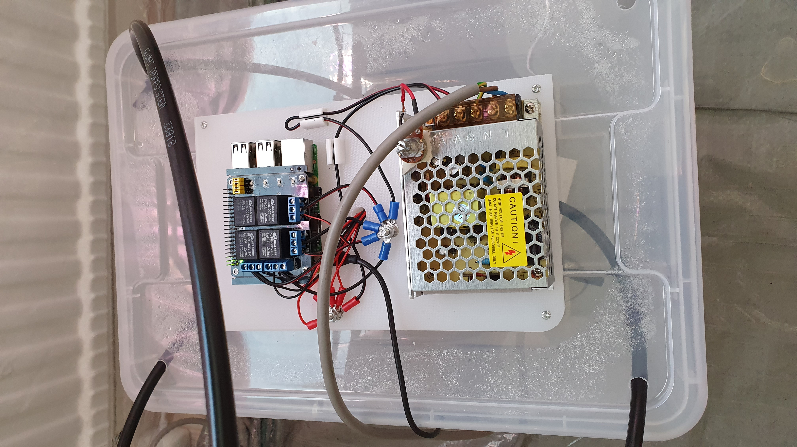
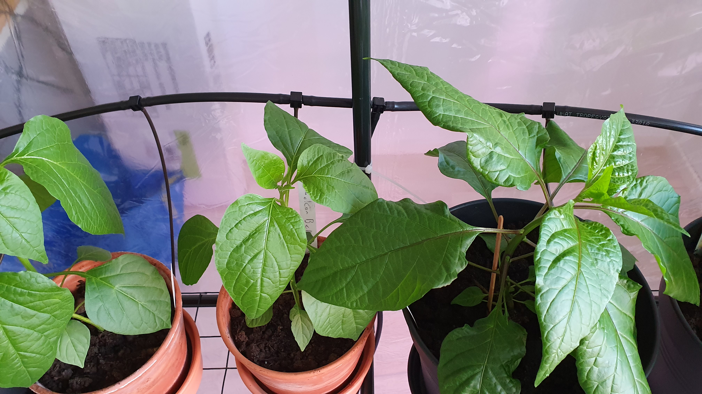

# Automatiserad bevattning

As the audience at this point is expected to be Swedish, I've chosen to present it in Swedish.
Should you not speak Swedish, and wish for some specifics which can't be figured out from Google Translate or such, feel free to contact me and I will be happy to take those parts in English.

## Inledning 
Det talas i många nördiga kretsar idag om "det smarta hemmet" och automatisering.
Jag har länge haft tankar kring konceptet "smarta hem", och lever (bland annat) på att automatisera saker, vilket den som skummar genom mina repon lätt kan se.

När jag således började tröttna lite på de chilisorter matbutikerna saluför, och tog upp chiliodling som hobby, såg jag min chans att kompensera för mina bristfälligt gröna fingrar med det jag är bra på: datorteknik.

Min chiliodling består i skrivande stund av 18 olika chilisorter, vissa nysådda och vissa färdiga att börja ge frukt inom en snar framtid. Det är ett under att plantstackarna överlevt så långt som de gjort, men ja ... nu har jag ett problem mindre att fundera på, nämligen bevattningen.

Att bo i hyreslägenhet har sina för och nackdelar. Nackdelarna är givetvis begränsad yta utomhus (särskilt när man som jag bor på fjärde våningen)
och att vattentillgången är begränsad till handfat, diskbänk, dusch och toalett. Likaså att jag inte kan göra vilka ingrepp som helst.
Detta innebär för min del att jag blev tvungen att ha en lösning utan rinnande vatten ända fram till plantorna, så en tank var ett måste. 
En tank innebär även pumpar eller hög placering. Hög placering var inte ett alternativ, inte minst eftersom läckagerisken inte är värd att ta.

## Kravställning
Bevattningen skall vara:
- skalbar upp till den mängd plantor som ryms i mitt växthus (cirkus ett trettiotal).
- automatiserad till den grad att jag (efter intrimning) endast behöver ha koll på mängden vatten i tanken.
- utbyggningsbar till att kunna övervakas på distans, såväl gällande funktion som data från godtyckliga sensorer.
- kompakt. Lösningen skall ta såpass liten plats att antalet plantor på given yta endast marginellt behöver minskas.

## Hårdvara
Beskrivning, (Inköpsställe, pris inkl. frakt)
- Skärbräda LEGITIM (IKEA, 20 SEK)
- Låda + lock SAMLA (IKEA, 35 SEK)
- SANPU CPS50-W1V12 12V DC Power Supply 60W 5A (Amazon 177 SEK)
- 4 x Mini fountain pump, UEETEK Submersible Pump DC12V (Amazon SEK 304)
- Blumat matarslang 8mm, droppslang 3mm, T-kopplingar samt ändplugg (hydrogarden.se, metervara, kopplingar 9 SEK/st)
- Raspberry Pi 3B (Någonstans, hades sedan tidigare)
- PiRelay Expansion board for RPI (Amazon, £12.49)
- Diverse skruv, brickor, muttrar, kablage, lödtenn och kabelskor. (Kjell & Co, okänt pris)

## Konstruktion
Då jag som sagt bor i hyreslägenhet är verktyg och möjlighet att använda dessa tämligen begränsade. Tack vare en god kollega löstes dock en sådan enkel sak som att såga upp skärbrädan i två delar. 
Dock innebar detta att jag inte har någon fin bild på det steget.

Jag bemödade mig inte heller med att ta bilder på alla steg i processen, exempelvis vid borrandet av hål, men om du avser att replikera detta bygge räknar jag kallt med att du vet hur en borrmaskin fungerar,
hur man mäter ut var hål ska sitta och hur man mäter diametern på skruv och borr.

### Pumpar, basplattor och tank
"Tanken" förblir omodifierad. Basplattan för pumparna får ligga löst då fästandet av plattan i botten skulle medföra en risk för läckage, något som inte är önskat.
Pumparna fästes med medföljande fästen, skruv, bricka och mutter. Skruvskallarna försänktes på undersidan för att få ner plattan så nära botten som möjligt.

På tankens lock borrades hål för slangar (i hörnen), för montering av elektronikens basplatta samt ett hål rakt genom basplatta och lock för dragning av strömkablar till pumparna. Lockets plast var tämligen hård att borra i, men skärbrädan var lättborrad.

Elektronikens basplatta krävde förstås ytterligare några hål för att montera RPi:n och nätagget. Även knutpunkter för strömförsörjningen krävde hål. (Potentiometern på bilden kom ej att användas i slutänden då pumparna höll lagom tryck vid 12 V). Därefter monterades RPi och nätagg och kablage för strömförsörjning drogs. Därefter kopplades jord till pump, samt pump och 12 V till relä.

### Färdigställande av mjukvara
Sedvanlig installation av Raspbian genomfördes, GPIO-pinnar tilläts att användas och likaså SSH. 
För enkelhetens skull lät jag script och schemaläggning köras som root för att ha enkel tillgång till GPIO-pinnarna. 
Självklart inaktiverades defaultkontot (`pi`) och inloggning till root-kontot tilläts endast via nyckelbaserad autentisering.
Boot till GUI stängdes av.

### Funktionstest
Dags så att strömsätta det hela för en funktionstest.

Ja, det verkar spruta på rätt så skapligt. Vi kompletterar med en matarslang upp till brukshöjd och testar lite T-kopplingar och droppslangar.

Fungerar till synes som tänkt. En enklare mätning visar på en faktisk pumpkapacitet om ungefär 1,2 l/min, ett värde vi kan använda för att beräkna körtiden för pumparna.

Allt som återstår är då att dra slangar och montera kopplingar.

## Mjukvara
Då jag är \*nixadmin till yrket föll det sig naturligt att nyttja ett enkelt shellscript till att styra reläerna, vilket i sin tur kan schemaläggas i cron.

Distributionen föll naturligt på Raspbian då den kommer med väl utvalda verktyg för just Raspberry Pi. Även om jag inte är en stor fan av Debian så får jag ge att i det här sammanhanget så är det den kanske bäst lämpade disten.

### Scripten
Funktionaliteten inlednindsvis styrs av ett script vilket åkallar ett script vilket har ett stödscript med några enkla funktioner

#### pump.sh
Detta script gör först och främst ett par koller så att vi åkallar det korrekt. Jag har satt en limit på 0-31 sekunders pumptid för att undvika att man matar in längre tider av misstag och då råka pumpa ut hela tanken och dränka plantor och golv.

Syntaxen är exempelvis (för 22 sekunders pumpning på pump 3):

`pump.sh 3 22`

Scriptet åkallar pinout.sh (default är att det läggs i roots hemkatalog) och sätter aktuell pin till `hög` (1), väntar pumptiden ut, och sätter sedan genom samma script aktuell pin till `låg` (0).

#### pinout.sh
Exporterar pin vid behov via funktion i `pinbase.sh` och sätter sedan aktuell pin till utgående, och aktiverar/deaktiverar till sist denna pin.

#### pinbase.sh
Erbjuder stödfunktioner för exportering av pin och riktning (in/ut). In används inte för närvarande, men kan komma att användas senare vid läsning av sensorer.

### crontab
Aktuell crontab (`# crontab -e`) gör följande:

Rad 1: Klockan 18:00 varje jämn dag (märk väl att detta ej är varannan dag i månader med 31/29 dagar) alla månader, oavsett veckodag, kör pump 1 i 30 sekunder utan textoutput.

Rad 2: Klockan 18:01 varje dag, kör pump 2 i 30 sekunder.

`0 18 2-30/2 * * /root/pump.sh 1 30 >/dev/null 2>&1`

`0 18 * * * /root/pump.sh 2 30 >/dev/null 2>&1`

## Sammanfattning
De värden som används här är initiala körningsvärden specifikt för de pumpar och antal krukor jag använder. Innan du börjar bevattna bör du provköra systemet och mäta upp flödeshastigheter för just dina pumpar.

Den kod som du finner här står dig fritt att använda som du behagar. Jag uppskattar givetvis feedback på den och hoppas att du delar med dig av eventuella förbättringar.
